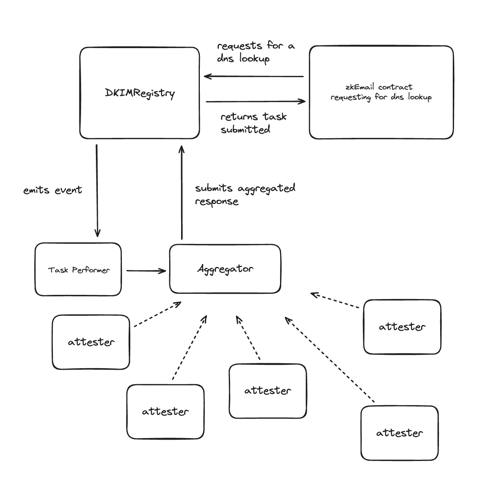

# DNS Registry AVS

## Description

An E-Mail DNS registry which looks up the DKIM key of a domain, given its selector and domain. This DKIM public key can be used to verify the DKIM signature of an email.

Currently zkEmail uses an oracle service to fetch the DKIM key of a domain. This service is not decentralised and lacks control. This project aims to create a decentralized and secure way to fetch the DKIM key of a domain by using Othentic to create an Actively Validated Service (AVS) for the DNS registry.

## Architecture

The zkEmail contracts map domain names to their respective DKIM keys. If there is a domain name whose key is not valid, it calls a function on the serviceManager contract of the AVS called the DKIMRegistry which emits an event.
This triggers a DNS lookup performed by the execution service of the AVS. After submitting a proof of task to the aggregator, the task is broadcasted to the P2P network. The attesters validate the proof of task and submit the data to the contract. After consensus is reached, the DKIM key is stored in the contract.

There are 3 primary services in an AVS:
1. **Task Performer**: This service is responsible for listening for events emitted by the solidity contract. Upon receiving an event, it calls the execution service with the domain and its selector. Upon receiving the DKIM key and the proof of task from the execution service, it submits the proof of task, data, transactionId, and the signature to the aggregator.
2. **Execution Service**: This service is responsible for fetching the DKIM key of a domain. It receives the domain and selector from the task performer, fetches the DKIM key, and generates a proof of task. It then returns the DKIM key and the proof of task to the task performer.
3. **Validation Service**: The aggregator shares the proof of task with the validation service. This validation service verifies the proof of task and returns a boolean value. If the proof of task is valid (validated by multiple attesters), the aggregator submits the data to the contract.

## Key Implementation Details
The existing internet IC-DNS-Oracle used by zkEmail, is replaced by the AVS. The oracle makes HTTP queries to Google's DNS servers to fetch the DKIM key of a domain. This creates a single point of failure and is overly reliant on a single DNS provider. On top of that it makes HTTP requests to `dns.google` instead of using the DNS protocol directly. 

In this implementation, the execution and validation services implemented in Rust, fetch the DKIM key of a domain by using the DNS protocol directly and can be ***easily*** configured to use any (or multiple) DNS providers. This makes this implementation decentralised, reliable and fast.

Note: Using the task performer to propagate the query parameters (selector and domain) along with the proof of task to the P2P network for validation makes the network vulnerable to an adverserial operator. The malicious operator in this case can tamper the query parameters and submit a false DKIM key which will be validated by the attesters. This can be mitigated by propagating the transaction hash instead of the query parameters and fetching the query parameters from the contract.

## Starting the AVS

After setting the environment variables, one can start the AVS by simply starting the services with `docker-compose up`.

## Roadmap

- [x] Write the primary services of the AVS in Rust
- [x] Deployment script for starting the AVS services with Othentic
- [ ] Implement the DKIMRegistry Contract
- [ ] Address potential security vulnerabilities
    - [ ] Prevention of spam attacks
    - [ ] To call every DNS provider for querying a public key or employ a Round Robin strategy
